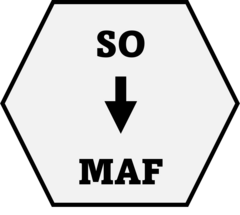

<!-- README.md is generated from README.Rmd. Please edit that file -->

# mutationtypes 

<!-- badges: start -->

[](https://lifecycle.r-lib.org/articles/stages.html#experimental)
[](https://CRAN.R-project.org/package=mutationtypes)
[](https://github.com/selkamand/mutationtypes/actions/workflows/R-CMD-check.yaml)
[](https://app.codecov.io/gh/selkamand/mutationtypes?branch=master)
[](https://github.com/selkamand/mutationtypes)
[](https://cran.r-project.org/package=mutationtypes)

[](https://github.com/selkamand/mutationtypes)
[](https://cran.r-project.org/package=mutationtypes)
[](https://cran.r-project.org/package=mutationtypes)
<!-- badges: end -->

Say you want to describe the impact of a mutation. There exists several
dictionaries you could use, including

1)  [Sequence Ontology](http://www.sequenceontology.org/). These terms
    are what VEP uses

2)  [MAF Variant
    Classification](https://docs.gdc.cancer.gov/Encyclopedia/pages/Mutation_Annotation_Format_TCGAv2/)

3)  [PAVE](https://github.com/hartwigmedical/hmftools/blob/master/pave/README.md)
    Consequences that the PAVE annotator supports (mostly a subset of SO
    terms but with a couple of additions to indicate when a non-obvious
    consequence can be found thanks to phasing)

**mutationtypes** makes it easy to check whether your vector of mutation
types aligns to one of these dictionaries. It also simplifies
translation from one dictionary to another.

## Installation

Install from CRAN:

``` r
install.packages("mutationtypes")
```

Alternatively, you can install the development version of mutationtypes
like so:

``` r
# install.packages('remotes')
remotes::install_github('selkamand/mutationtypes')
```

## Usage

``` r
library(mutationtypes)

# Check which mutation impact dictionary you're vector is closest too
mutation_types_identify(
  c(
    "INTRAGENIC", 
    "INTRAGENIC", 
    "intergenic_region", 
    "stop_lost", 
    "missense_variant", 
    "missense_variant"
  )
)
#> 
#> ── Identify Class ──
#> 
#> ℹ Found 4 unique mutation types in input set
#> ℹ 2/4 mutation types were valid PAVE terms
#> ℹ 4/4 mutation types were valid SO terms
#> ℹ 0/4 mutation types were valid MAF terms
#> 
#> ── PAVE Mutation Types ──
#> 
#> → stop_lost and missense_variant
#> [1] "SO"

# Convert sequence ontology mutation classes to MAF terms
mutation_types_convert_so_to_maf(
  so_mutation_types = c(
    "INTRAGENIC", 
    "INTRAGENIC", 
    "intergenic_region", 
    "stop_lost", 
    "missense_variant", 
    "missense_variant"
  )
)
#> 
#> ── Validating Input ──
#> 
#> ✔ Supplied mutation types are valid so terms
#> [1] "Intron"            "Intron"            "IGR"              
#> [4] "Nonstop_Mutation"  "Missense_Mutation" "Missense_Mutation"

# Convert PAVE mutation classes to MAF terms
mutation_types_convert_pave_to_maf(
  pave_mutation_types = c('upstream_gene_variant', 'phased_inframe_insertion', 'phased_missense')
)
#> 
#> ── Validating Input ──
#> 
#> ✔ Supplied mutation types are valid pave terms
#> [1] "5'Flank"           "In_Frame_Ins"      "Missense_Mutation"

# Get list of valid MAF terms
mutation_types_maf()
#>  [1] "Splice_Site"            "Nonsense_Mutation"      "Frame_Shift_Del"       
#>  [4] "Frame_Shift_Ins"        "In_Frame_Ins"           "In_Frame_Del"          
#>  [7] "Missense_Mutation"      "Splice_Region"          "Intron"                
#> [10] "Nonstop_Mutation"       "Translation_Start_Site" "Silent"                
#> [13] "RNA"                    "5'UTR"                  "3'UTR"                 
#> [16] "5'Flank"                "3'Flank"                "Targeted_Region"       
#> [19] "IGR"

# Get list of valid SO terms
mutation_types_so()
#>  [1] "transcript_ablation"                           
#>  [2] "exon_loss_variant"                             
#>  [3] "splice_acceptor_variant"                       
#>  [4] "splice_donor_variant"                          
#>  [5] "stop_gained"                                   
#>  [6] "frameshift_variant"                            
#>  [7] "stop_lost"                                     
#>  [8] "start_lost"                                    
#>  [9] "initiator_codon_variant"                       
#> [10] "inframe_insertion"                             
#> [11] "inframe_deletion"                              
#> [12] "protein_altering_variant"                      
#> [13] "missense_variant"                              
#> [14] "conservative_missense_variant"                 
#> [15] "rare_amino_acid_variant"                       
#> [16] "transcript_amplification"                      
#> [17] "splice_region_variant"                         
#> [18] "splice_donor_5th_base_variant"                 
#> [19] "splice_donor_region_variant"                   
#> [20] "splice_polypyrimidine_tract_variant"           
#> [21] "start_retained_variant"                        
#> [22] "stop_retained_variant"                         
#> [23] "synonymous_variant"                            
#> [24] "incomplete_terminal_codon_variant"             
#> [25] "coding_sequence_variant"                       
#> [26] "mature_miRNA_variant"                          
#> [27] "exon_variant"                                  
#> [28] "5_prime_UTR_variant"                           
#> [29] "3_prime_UTR_variant"                           
#> [30] "5_prime_UTR_premature_start_codon_gain_variant"
#> [31] "non_coding_transcript_exon_variant"            
#> [32] "non_coding_exon_variant"                       
#> [33] "INTRAGENIC"                                    
#> [34] "intragenic_variant"                            
#> [35] "intron_variant"                                
#> [36] "non_coding_transcript_variant"                 
#> [37] "nc_transcript_variant"                         
#> [38] "NMD_transcript_variant"                        
#> [39] "upstream_gene_variant"                         
#> [40] "downstream_gene_variant"                       
#> [41] "TFBS_ablation"                                 
#> [42] "TFBS_amplification"                            
#> [43] "TF_binding_site_variant"                       
#> [44] "regulatory_region_ablation"                    
#> [45] "regulatory_region_amplification"               
#> [46] "regulatory_region_variant"                     
#> [47] "regulatory_region"                             
#> [48] "feature_elongation"                            
#> [49] "feature_truncation"                            
#> [50] "intergenic_variant"                            
#> [51] "intergenic_region"

# Get list of valid PAVE terms
mutation_types_pave()
#>  [1] "upstream_gene_variant"              "intron_variant"                    
#>  [3] "5_prime_UTR_variant"                "3_prime_UTR_variant"               
#>  [5] "non_coding_transcript_exon_variant" "synonymous_variant"                
#>  [7] "phased_synonymous"                  "missense_variant"                  
#>  [9] "inframe_insertion"                  "inframe_deletion"                  
#> [11] "phased_inframe_insertion"           "phased_inframe_deletion"           
#> [13] "phased_missense"                    "stop_gained"                       
#> [15] "frameshift_variant"                 "start_lost"                        
#> [17] "stop_lost"                          "splice_donor_variant"              
#> [19] "splice_acceptor_variant"

# Get Palettes for MAF/SO/PAVE terms
mutation_types_maf_palette()
#>            Splice_Site      Nonsense_Mutation        Frame_Shift_Del 
#>              "#33A02C"              "#FB9A99"              "#E31A1C" 
#>        Frame_Shift_Ins           In_Frame_Ins           In_Frame_Del 
#>              "#E31A1C"              "#CAB2D6"              "#6A3D9A" 
#>      Missense_Mutation          Splice_Region                 Intron 
#>              "#1F78B4"              "#B2DF8A"              "#FDBF6F" 
#>       Nonstop_Mutation Translation_Start_Site                 Silent 
#>              "#A6CEE3"              "#B15928"              "#FDBF6F" 
#>                    RNA                  5'UTR                  3'UTR 
#>              "#FDBF6F"              "#FDBF6F"              "#FDBF6F" 
#>                5'Flank                3'Flank        Targeted_Region 
#>              "#FDBF6F"              "#FDBF6F"              "#FDBF6F" 
#>                    IGR 
#>              "#FDBF6F"
```
